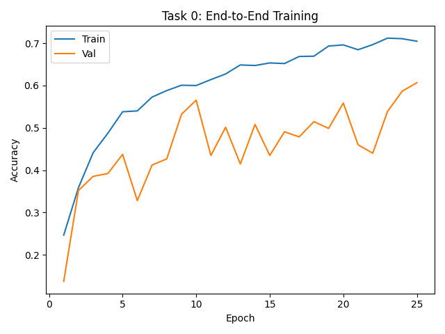
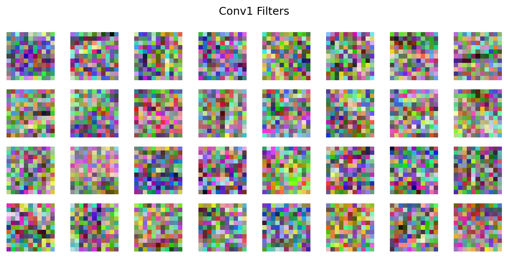
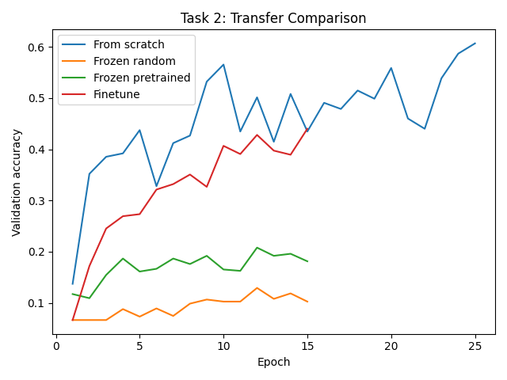

# Homework X – Reslog

Write your responses in the space below.
Do NOT edit below the divider line.

Implemented the required Task 0, Task 1, and Task 2 code in `code/student.py`.

For Task 0, here is the required training curve plot.


Task 0 summary: train accuracy increased steadily to about 0.71, while validation accuracy reached about 0.61. The model learned useful scene features, with a moderate train/validation gap indicating some overfitting.

For Task 1, here is the required filter visualization.


Task 1 summary: the learned first-layer filters show oriented edge-like structure rather than random noise. Rotation pretraining accuracy increased from roughly chance level at the start to about 0.99 by the end of training.

For Task 2, here is the required transfer comparison plot.


Task 2 summary: frozen random features performed worst, frozen pretrained features performed better, and finetuning performed best among the transfer settings. This suggests that the rotation-pretrained encoder learned transferable visual structure, and that the pretrained features became more useful when adapted to the 15-scene classification task.

Best validation accuracies:
- From scratch: about 0.61
- Frozen random: about 0.13
- Frozen pretrained: about 0.21
- Finetune: about 0.44

Required files were generated and saved in `code/results/`.

## Extra credit?

I did not attempt extra credit.


---
# CSCI 1430 Results Log

This log help us to grade your work; it is not a report or write up.
- Be brief and precise.
- Be anonymous.

For each homework:
- Include the homework required items.
- Report if you attempted extra credit, let us know where it is in your code, and show its results.
- Any other information that you'd like us to have in grading, e.g., anything unusual or special, please let us know.

**Make sure** to commit all the required files to Github!

## Required homework items

In response to question x, here's my text answer.

In response to question x, here is a required image.


I could also provide a code snippet here, if I need to.
```
one = 1;
two = one + one;
if two == 2
    disp( 'This computer is not broken.' );
end
```

## Extra credit?

I attemped these extra credits:
- One. In `thiscode.py`. The results were that xxxx. Here's an image:


- Two. In `thatcode.py`. The result was that yyyy. I even used some maths $xyz$.

## Anything else?

Giraffes---_how do they even?!_ 🦒